# Process map — Cluster assessment run-sheet

> Generated by the `map-process` skill from [docs/process-assessment.md](/docs/process-assessment.md). **Regenerate — do not hand-edit.**

**12 steps · 12 gates** — 11 machine-gated, 1 human-only, **0 flagged** for review.

## Flowchart

```mermaid
flowchart TD
  S1["1 · Transcribe the units of competency<br/><i>🏠 transcribe-uoc</i>"]:::step
  S2["2 · Consolidate the cluster's UoCs<br/><i>🏠 consolidate-uocs, inventory_uoc</i><br/><i>📦 consolidated_uoc.md</i>"]:::step
  S3["3 · Audit source assessments<br/><i>📦 consolidated_uoc.md</i><br/><i>👤 human-led</i><br/><i>(brownfield only — optional; skip if greenfield)</i>"]:::step
  S4["4 · Assessment plan<br/><i>📦 assessment_plan.md, assessment-plan-format.md</i><br/><i>👤 human-led</i><br/><i>(per cluster)</i>"]:::step
  S5["5 · Consolidate the assessment plans<br/><i>🏠 generate-consolidated-plan</i><br/><i>📦 assessment_plan.md</i><br/><i>👤 human-led</i><br/><i>(per scenario — after every cluster's step 4)</i>"]:::step
  S6["6 · Scenario plan<br/><i>👤 human-led</i><br/><i>(per scenario — developed from the completed contract)</i>"]:::step
  S7["7 · Scenario materials<br/><i>👤 human-led</i><br/><i>(per scenario — built from the scenario plan; timing flexible)</i>"]:::step
  S8["8 · Assessor instruments<br/><i>👤 human-led</i><br/><i>(loop per AT)</i>"]:::step
  S9["9 · Student instruments<br/><i>👤 human-led</i><br/><i>(loop per AT)</i>"]:::step
  S10["10 · Mapping documents<br/><i>🏠 generate_mapping_doc</i><br/><i>👤 human-led</i><br/><i>(cluster-level)</i>"]:::step
  S11["11 · Cluster coverage<br/><i>📦 consolidated_uoc.md</i><br/><i>👤 human-led</i><br/><i>(capstone)</i>"]:::step
  S12["12 · Institutional pre-validation<br/><i>👤 human-led</i>"]:::step
  G1_2{{"Gate 1→2<br/>validate-uoc-transcription, validate_uoc.py + human"}}:::built
  G2_3{{"Gate 2→3<br/>validate-uoc-consolidation, validate_consolidated.py + human"}}:::built
  G3_4{{"Gate 3→4<br/>evaluate-legacy-materials"}}:::built
  G4_5{{"Gate 4→5<br/>validate-assessment-plan + human"}}:::built
  G5_6{{"Gate 5→6<br/>validate-consolidated-plan"}}:::built
  G6_7{{"Gate 6→7<br/>validate-scenario-plan + human"}}:::built
  G7_8{{"Gate 7→8<br/>verify-scenario-realisation + human"}}:::built
  G8_9{{"Gate 8→9<br/>validate-at-traceability + human"}}:::built
  G9_10{{"Gate 9→10<br/>validate-student-instrument + human"}}:::built
  G10_11{{"Gate 10→11<br/>validate-mapping-doc + human"}}:::built
  G11_12{{"Gate 11→12<br/>validate-cluster-coverage + human"}}:::built
  G12_done{{"Gate 12→done<br/>human review"}}:::human
  DONE(["done"]):::done
  S1 --> G1_2
  G1_2 -->|PASS| S2
  S2 --> G2_3
  G2_3 -->|PASS| S3
  S3 --> G3_4
  G3_4 -->|PASS| S4
  S4 --> G4_5
  G4_5 -->|PASS| S5
  S5 --> G5_6
  G5_6 -->|PASS| S6
  S6 --> G6_7
  G6_7 -->|PASS| S7
  S7 --> G7_8
  G7_8 -->|PASS| S8
  S8 --> G8_9
  G8_9 -->|PASS| S9
  S9 --> G9_10
  G9_10 -->|PASS| S10
  S10 --> G10_11
  G10_11 -->|PASS| S11
  S11 --> G11_12
  G11_12 -->|PASS| S12
  S12 --> G12_done
  G12_done -->|PASS| DONE
  classDef step fill:#eef2f7,stroke:#5b6b7f,color:#1f2933;
  classDef built fill:#d7ecd9,stroke:#2e7d32,color:#173a1a;
  classDef human fill:#fdecc8,stroke:#b8860b,color:#4a3510;
  classDef flag fill:#f6c6c6,stroke:#b71c1c,color:#4a1010;
  classDef done fill:#dfe7ef,stroke:#5b6b7f,color:#1f2933;
```

## Tooling & locus by stage

| Step | 🏠 Umbrella tooling (skill 🛠 · agent 🤖 · engine ⚙ · MCP 🔌) | 📦/🌐 Sub-repo data drawn on | Actor |
|---|---|---|---|
| 1 · Transcribe the units of competency | 🛠 `transcribe-uoc` | — | ⚙ tool-driven |
| 2 · Consolidate the cluster's UoCs | 🛠 `consolidate-uocs`, ⚙ `inventory_uoc` | 📦 `consolidated_uoc.md` | ⚙ tool-driven |
| 3 · Audit source assessments | — | 📦 `consolidated_uoc.md` | 👤 human-led |
| 4 · Assessment plan | — | 📦 `assessment_plan.md`, 📦 `assessment-plan-format.md` | 👤 human-led |
| 5 · Consolidate the assessment plans | 🛠 `generate-consolidated-plan` | 📦 `assessment_plan.md` | 👤 human-led |
| 6 · Scenario plan | — | — | 👤 human-led |
| 7 · Scenario materials | — | — | 👤 human-led |
| 8 · Assessor instruments | — | — | 👤 human-led |
| 9 · Student instruments | — | — | 👤 human-led |
| 10 · Mapping documents | ⚙ `generate_mapping_doc` | — | 👤 human-led |
| 11 · Cluster coverage | — | 📦 `consolidated_uoc.md` | 👤 human-led |
| 12 · Institutional pre-validation | — | — | 👤 human-led |

## Legend

- **Grey step** — a unit of work. Locus sub-lines: **🏠** the umbrella tooling it runs (skill/engine/agent), **📦/🌐** the sub-repo / website data it draws on, **👤** if human-led, then loop scope.
- **Green gate** — a machine validator resolves (built).  
- **Amber gate** — human-only (no validator yet) — candidate for tooling.  
- **Red gate** — an audit flag: a named validator that resolves nowhere, or a doc status marker that contradicts what exists.

## Cross-check / audit table

| Gate | Kind | Names | Resolves to | Doc status | Audit flag |
|---|---|---|---|---|---|
| 1→2 | validator | `validate-uoc-transcription`, `validate_uoc.py`, `.docx`, `.md` | `validate-uoc-transcription`→skill; `validate_uoc.py`→script | — | ✓ ok |
| 2→3 | validator | `validate-uoc-consolidation`, `validate_consolidated.py` | `validate-uoc-consolidation`→skill; `validate_consolidated.py`→script | — | ✓ ok |
| 3→4 | other | `evaluate-legacy-materials` | `evaluate-legacy-materials`→agent | — | ✓ ok |
| 4→5 | validator | `validate-assessment-plan`, `SR-*`, `SR-*` | `validate-assessment-plan`→skill | — | ✓ ok |
| 5→6 | validator | `validate-consolidated-plan`, `SR-*` | `validate-consolidated-plan`→skill | — | ✓ ok |
| 6→7 | validator | `validate-scenario-plan`, `SR-*`, `SR-*` | `validate-scenario-plan`→skill | — | ✓ ok |
| 7→8 | human | `verify-scenario-realisation`, `partial`, `mismatch` | `verify-scenario-realisation`→agent | built | ✓ ok |
| 8→9 | validator | `validate-at-traceability`, `--expect` | `validate-at-traceability`→skill | — | ✓ ok |
| 9→10 | validator | `validate-student-instrument`, `[UNIT SEC num]` | `validate-student-instrument`→skill | built | ✓ ok |
| 10→11 | validator | `validate-mapping-doc` | `validate-mapping-doc`→skill | — | ✓ ok |
| 11→12 | validator | `validate-cluster-coverage`, `--include-ac` | `validate-cluster-coverage`→skill | — | ✓ ok |
| 12→done | human | human | — | — | human-only gate — candidate for tooling |

