# Process map — Cluster delivery run-sheet

> Generated by the `map-process` skill from [docs/process-delivery.md](/docs/process-delivery.md). **Regenerate — do not hand-edit.**

**6 steps · 6 gates** — 5 machine-gated, 1 human-only, **0 flagged** for review.

## Flowchart

```mermaid
flowchart TD
  S1["1 · Cluster specification (delivery frame)<br/><i>🏠 setup-cluster-spec</i><br/><i>📦 cluster-specification.md</i><br/><i>(per cluster; gate is semester-level)</i>"]:::step
  S2["2 · Topic breakdown<br/><i>📦 coverage.md</i><br/><i>👤 human-led</i><br/><i>(loop per AT)</i>"]:::step
  S3["3 · Topic spec (coverage.md)<br/><i>📦 coverage.md, consolidated_uoc.md</i><br/><i>👤 human-led</i><br/><i>(loop per Topic)</i>"]:::step
  S4["4 · Slide plan → Topic deck<br/><i>🏠 draw-diagram, image-gen, build_topic_deck, deck_images, kangan_deck</i><br/><i>📦 slide_plan.md, coverage.md, aws-recorded-demos-catalogue.md, aws-deck-catalogue-draft.md</i><br/><i>👤 human-led</i><br/><i>(loop per Topic)</i>"]:::step
  S5["5 · Practice tasks<br/><i>🌐 states.ts</i><br/><i>👤 human-led</i><br/><i>(loop per AT)</i>"]:::step
  S6["6 · Delivery plan<br/><i>📦 Delivery_Plan_Template_v0.1.docx, delivery-plan.md, S1_CL1_Delivery_Plan.docx, cl1-delivery-sessions-draft.md</i><br/><i>👤 human-led</i><br/><i>(cluster-level — capstone)</i>"]:::step
  G1_2{{"Gate 1→2<br/>validate-cluster-spec + human"}}:::built
  G2_3{{"Gate 2→3<br/>validate-topic-breakdown + human"}}:::built
  G3_4{{"Gate 3→4<br/>validate-delivery-coverage, validate-cluster-coverage + human"}}:::built
  G4_5{{"Gate 4→5<br/>validate-slide-plan, inspect-file-size, review-slides + human"}}:::built
  G5_6{{"Gate 5→6<br/>human review"}}:::human
  G6_done{{"Gate 6→done<br/>validate-delivery-plan + human"}}:::built
  DONE(["done"]):::done
  S1 --> G1_2
  G1_2 -->|PASS| S2
  S2 --> G2_3
  G2_3 -->|PASS| S3
  S3 --> G3_4
  G3_4 -->|PASS| S4
  S4 --> G4_5
  G4_5 -->|PASS| S5
  S5 --> G5_6
  G5_6 -->|PASS| S6
  S6 --> G6_done
  G6_done -->|PASS| DONE
  classDef step fill:#eef2f7,stroke:#5b6b7f,color:#1f2933;
  classDef built fill:#d7ecd9,stroke:#2e7d32,color:#173a1a;
  classDef human fill:#fdecc8,stroke:#b8860b,color:#4a3510;
  classDef flag fill:#f6c6c6,stroke:#b71c1c,color:#4a1010;
  classDef done fill:#dfe7ef,stroke:#5b6b7f,color:#1f2933;
```

## Tooling & locus by stage

| Step | 🏠 Umbrella tooling (skill 🛠 · agent 🤖 · engine ⚙ · MCP 🔌) | 📦/🌐 Sub-repo data drawn on | Actor |
|---|---|---|---|
| 1 · Cluster specification (delivery frame) | 🛠 `setup-cluster-spec` | 📦 `cluster-specification.md` | ⚙ tool-driven |
| 2 · Topic breakdown | — | 📦 `coverage.md` | 👤 human-led |
| 3 · Topic spec (`coverage.md`) | — | 📦 `coverage.md`, 📦 `consolidated_uoc.md` | 👤 human-led |
| 4 · Slide plan → Topic deck | 🛠 `draw-diagram`, 🛠 `image-gen`, ⚙ `build_topic_deck`, ⚙ `deck_images`, ⚙ `kangan_deck` | 📦 `slide_plan.md`, 📦 `coverage.md`, 📦 `aws-recorded-demos-catalogue.md`, 📦 `aws-deck-catalogue-draft.md`, 📦 `Topic_NN_Slides.pptx` | 👤 human-led |
| 5 · Practice tasks | — | 🌐 `states.ts` | 👤 human-led |
| 6 · Delivery plan | — | 📦 `Delivery_Plan_Template_v0.1.docx`, 📦 `delivery-plan.md`, 📦 `S1_CL1_Delivery_Plan.docx`, 📦 `cl1-delivery-sessions-draft.md` | 👤 human-led |

## Legend

- **Grey step** — a unit of work. Locus sub-lines: **🏠** the umbrella tooling it runs (skill/engine/agent), **📦/🌐** the sub-repo / website data it draws on, **👤** if human-led, then loop scope.
- **Green gate** — a machine validator resolves (built).  
- **Amber gate** — human-only (no validator yet) — candidate for tooling.  
- **Red gate** — an audit flag: a named validator that resolves nowhere, or a doc status marker that contradicts what exists.

## Cross-check / audit table

| Gate | Kind | Names | Resolves to | Doc status | Audit flag |
|---|---|---|---|---|---|
| 1→2 | validator | `validate-cluster-spec` | `validate-cluster-spec`→skill | — | ✓ ok |
| 2→3 | validator | `validate-topic-breakdown`, `assessments/AT<n>/`, `coverage.md`, `**AT<n> content Topic**` | `validate-topic-breakdown`→skill | built | ✓ ok |
| 3→4 | validator | `validate-delivery-coverage`, `coverage.md`, `consolidated_uoc.md`, `validate-cluster-coverage` | `validate-delivery-coverage`→script; `validate-cluster-coverage`→skill | built | ✓ ok |
| 4→5 | validator | `validate-slide-plan`, `coverage.md`, `inspect-file-size`, `review-slides` | `validate-slide-plan`→skill; `inspect-file-size`→skill; `review-slides`→skill | built | ✓ ok |
| 5→6 | human | human | — | — | human-only gate — candidate for tooling |
| 6→done | validator | `validate-delivery-plan`, `validate-delivery-plan` | `validate-delivery-plan`→skill | built | ✓ ok |

