# Factory process — overview

> Generated by `map-process`. How the factory's run-sheets chain: **Cluster assessment run-sheet → Cluster delivery run-sheet**.
> Each pipeline has its own detailed map (with audit table) alongside this file.

```mermaid
flowchart TD
  subgraph P0["Cluster assessment run-sheet"]
    P0_S1["1 · Transcribe the units of competency"]:::step
    P0_S2["2 · Consolidate the cluster's UoCs"]:::step
    P0_S3["3 · Audit source assessments"]:::step
    P0_S4["4 · Assessment plan"]:::step
    P0_S5["5 · Consolidate the assessment plans"]:::step
    P0_S6["6 · Scenario plan"]:::step
    P0_S7["7 · Scenario materials"]:::step
    P0_S8["8 · Assessor instruments"]:::step
    P0_S9["9 · Student instruments"]:::step
    P0_S10["10 · Mapping documents"]:::step
    P0_S11["11 · Cluster coverage"]:::step
    P0_S12["12 · Institutional pre-validation"]:::step
    P0_S1 --> P0_S2
    P0_S2 --> P0_S3
    P0_S3 --> P0_S4
    P0_S4 --> P0_S5
    P0_S5 --> P0_S6
    P0_S6 --> P0_S7
    P0_S7 --> P0_S8
    P0_S8 --> P0_S9
    P0_S9 --> P0_S10
    P0_S10 --> P0_S11
    P0_S11 --> P0_S12
  end
  subgraph P1["Cluster delivery run-sheet"]
    P1_S1["1 · Cluster specification (delivery frame)"]:::step
    P1_S2["2 · Topic breakdown"]:::step
    P1_S3["3 · Topic spec (coverage.md)"]:::step
    P1_S4["4 · Slide plan → Topic deck"]:::step
    P1_S5["5 · Practice tasks"]:::step
    P1_S6["6 · Delivery plan"]:::step
    P1_S1 --> P1_S2
    P1_S2 --> P1_S3
    P1_S3 --> P1_S4
    P1_S4 --> P1_S5
    P1_S5 --> P1_S6
  end
  P0_S12 ==>|outputs feed| P1_S1
  classDef step fill:#eef2f7,stroke:#5b6b7f,color:#1f2933;
  classDef built fill:#d7ecd9,stroke:#2e7d32,color:#173a1a;
  classDef human fill:#fdecc8,stroke:#b8860b,color:#4a3510;
  classDef flag fill:#f6c6c6,stroke:#b71c1c,color:#4a1010;
  classDef done fill:#dfe7ef,stroke:#5b6b7f,color:#1f2933;
```

